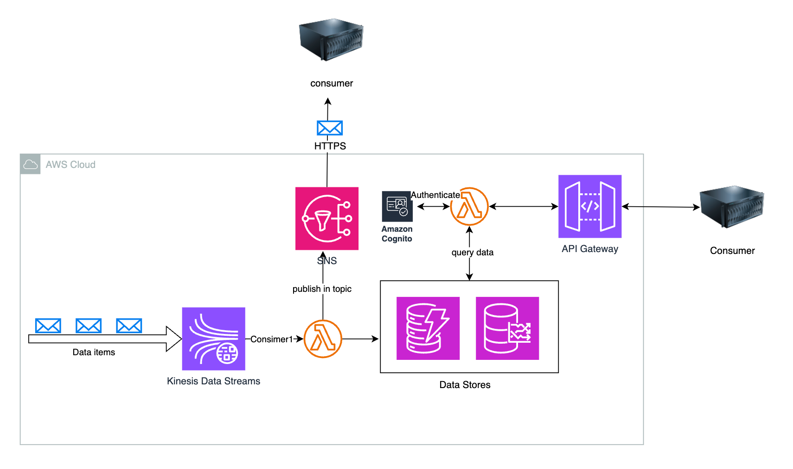

# Integration platform assignment
**Task:**
Imaginary customer needs an integration platform in the cloud. 
All the messages are in JSON format 
and there should be an API layer that exposes the integrations outside the platform in controlled manner. 
Both synchronous and asynchronous integration patterns should be used. 
On the sake of simplicity, you don’t have to take into account the integration message size.

 

The platform should take the following into account:
- Authentication, authorization
- Scalability
- Redundancy

Also, it should be very good if you could describe the approaches setting up the environment 
and maintaining it in cases that there is need for a change to it. 
How about information security. Are there some kind of approaches that you would prefer?
___

The solution represents a simple integration platform which delivers messages (JSONs) to consumers. 
The consumers can be subscribed for a topic by providing an HTTPS endpoint. The platform sends batches of data published in the topic to defined HTTPS endpoint.
Alternatively, an API exposes the integration and allows consumers request data using GET HTTPS request or use GraphQL to define parameters to be returned.

The platform presented as solution is built in AWS cloud.

> **Note:** the selection of the services and the final design would depend on the specific requirements, type of data and other factors that are unknown to me
___
**Solution description:**

Data can come to the platform from various sources such as
- MQTT message broker
- published directly with AWS SDK (i.e. boto3 for Python)
- sent via HTTP(S)
- etc.

No matter where data originates from, it is ingested by Kinesis Data Streams service. 
In our simple case, each message is assigned to a topic. The selection of what attribute is used as topic or how the value is determined would depend on specific application. In our case, we can assume, it is identifier of the data producer.

In Kinesis Data Streams, the topic would be used as a partition key. 
Therefore, messages with the same topic would share the same shard.

We assume the messages are relatively small and we do not need to consider their size. This allows us to use SNS service to send data to consumers via HTTPS (kind of webhook).
Data is sent to SNS to specific topic which matches the topics of our data items. SNS sends data to consumers via HTTPSs which are defined per topic.

Alternatively, I would implement a custom webhook functionality giving me more control in deciding how and where data is sent and also more flexibility about the message size and other SNS limitations ([ref](https://docs.aws.amazon.com/general/latest/gr/sns.html)).
A lambda function would make the job. Also, topics in SNS are strictly defined, meaning, creating topics dynamically could be troublesome.

Anyway, lambda function is needed to process data from Kinesis Data Stream and direct it to SNS as SNS can't be direct consumer of Kinesis Data Streams.

For synchronous data delivery, data stores are used. 
For heterogeneous data (likely case of JSONs as in task description), the best bet would be DynamoDB key-value NoSQL database.

In case of time-series data and need to monitor it, I would use Timestream, specialized time-series database providing extensive query options and built-in time-series functions such as interpolation. Additionally, it is well integrated with visualisation tools like Grafana.
However, if none of those benefits of Timestream could be leveraged, I would still go with DynamoDB and optimize table for handling time-series data (timestamp as sort key, well-chosen partition key).
I compared DynamoDB and Timestream, with partitioning taken into account, in my [research paper](ICSA2025_pre_submit.pdf)

Theoretically, data could be retrieved directly from Kinesis Data Streams. However, as also described in my [research paper](ICSA2025_pre_submit.pdf), it is slow and not efficient.
Therefore, a data store is used. It simplifies and speeds up data retrieval times. Since data is retrieved from specific topic and the topic can be used as partition key in DynamoDB, there is no need to do slow operations over multiple nodes (partitions). Instead, more efficient query operation can be used that retrieves data from specific node by partition key (topic).

Data stores can have time-to-live or retention period enabling automatic deletion of data item after specific time avoiding unnecessary costs.
For ling-time data storage, Amazon Data Firehose can be attached to Kinesis Data Streams and flush data into S3 service.

The API layer consists of API Gateway and a lambda function that queries data from data store. For authorisation and authentication, Amazon Cognito can be used.
My preferred option would be Oauth 2.0 with Client Key and Client secret (for M2M). In small and simpler system, due to simplicity and easiness of use I would opt for API Keys.
Amazon Cognito can tag users and define access control list (ACL). Therefore, specific users could be granted access only to specific topics.

It is also possible for client to subscribe to topic and let SNS to send data to provided HTTPS endpoint.
___

**Scalability and redundancy:**
The main service in the solution is Kinesis Data Streams. Its high horizontal scalability is achieved with shards. Based on the partition key (its 128-bit integer MD5 hash) data is assigned to specific shard.
The service can be scaled up or down by adding/removing shards. High availability and redundancy is achieved by shards being independent. Failure in one does not affect other. Also, they can be replicated in multiple availability zones.

Data Store (DynamoDB) keeps data in partitions. This also represents a great horizontal scalability.

Lambda function is also designed for good scalability by adding more concurrent executions and execution environments.

Suggested solution is presented below:

To provision the services, I would use Terraform. The Terraform state file I would host in S3 service.
Github actions or alternative could take care of applying changes performed in the Terraform and merged into main branch on GitHub.

The security would be achieved by using secured protocols for communication and data transfers. Inside the cloud environments, only necessary roles would have permission to perform only necessary actions in specific services. This should be the rule of thumb.
Granted tokens should have reasonably short validity and option to revoke already granted token (revoke it) could be implemented.
Ability to revoke granted tokens should be used if suspicious activity is identified.